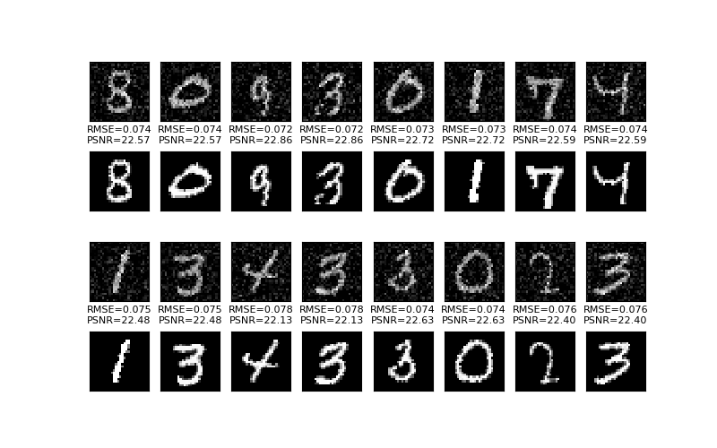
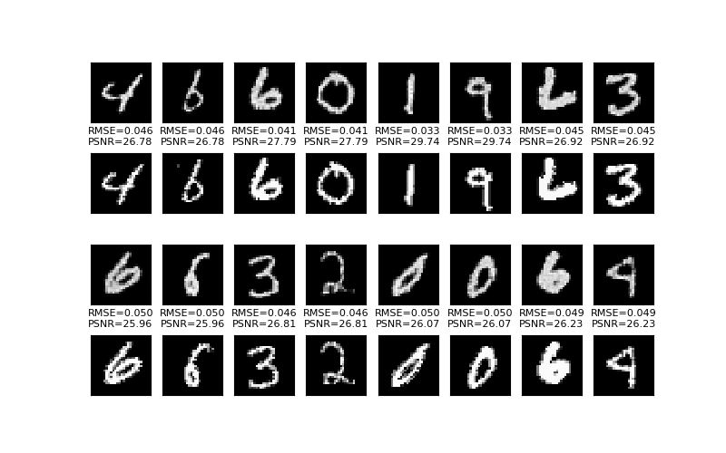

# Conditional GAN denoiser

Tensorflow/Keras implementation of a Conditional Generative Adversarial Network (CGAN) model that can be used for image denoising or artefact removal.

The CGAN consists of a generator network and a discriminator network. The generator takes noisy/artefact images as input, with the objective of getting as close to the true image as possible. The discriminator model takes true images or generated images as input, with the objective of distinguishing the two as accurately as possible. And so the networks engage in a fierce contest for loss supremacy...

The generator network model is based on U-Net, from [1].

Some choices in structure and model architecture were helped by the GalaxyGAN model: [Python implementation](https://github.com/jacobic/galaxygan), [paper](https://academic.oup.com/mnrasl/article/467/1/L110/2931732) [2].

## Install
Written to be compatible with Python 2.7 or 3.4 and above, but only tested on 2.7.13 and 3.6.7.

You will need [TensorFlow](https://www.tensorflow.org/install/), set up appropriately for your machine.

You can see the required Python packages listed in `environment.yml`. If you use Anaconda, you can use this file to install the authors' environment (note `tensorflow-gpu` is used, which requires a GPU):

    conda env create -f environment.yml

## Choose the data
The default demo, `test_cgan.py`, uses the MNIST digits dataset and applies Gaussian random noise to it as the condition for the generator model. Currently only Gaussian random noise has been implemented for noise/artefact generation. You can try your own data and implement your own noise/artefact generators.

The data is assigned at this line in `test_cgan.py`:

    (train_images, _), (_, _) = tf.keras.datasets.mnist.load_data()

The noise/artefacts are introduced with this line:

    train_inputs = artefacts.add_gaussian_noise(train_images, stdev=0.2).astype('float32')

## Run
The current demo trains the CGAN to denoise MNIST digits:

    python test_cgan.py

A plot with a small sample of training results will be saved to `out/noise_gan/data/{time_stamp}` for each epoch. The `time_stamp` is generated at execution time, and the rest of the path is set in `config.py`.

Example starting condition:

Example training result:

## References
[1] Ronneberger, Olaf, Philipp Fischer, and Thomas Brox. "U-net: Convolutional networks for biomedical image segmentation." In International Conference on Medical image computing and computer-assisted intervention, pp. 234-241. Springer, Cham, 2015.

[2] Schawinski, Kevin, Ce Zhang, Hantian Zhang, Lucas Fowler, and Gokula Krishnan Santhanam. "Generative adversarial networks recover features in astrophysical images of galaxies beyond the deconvolution limit." Monthly Notices of the Royal Astronomical Society: Letters 467, no. 1 (2017): L110-L114.
